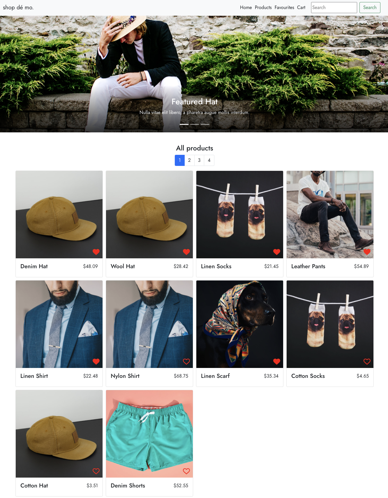
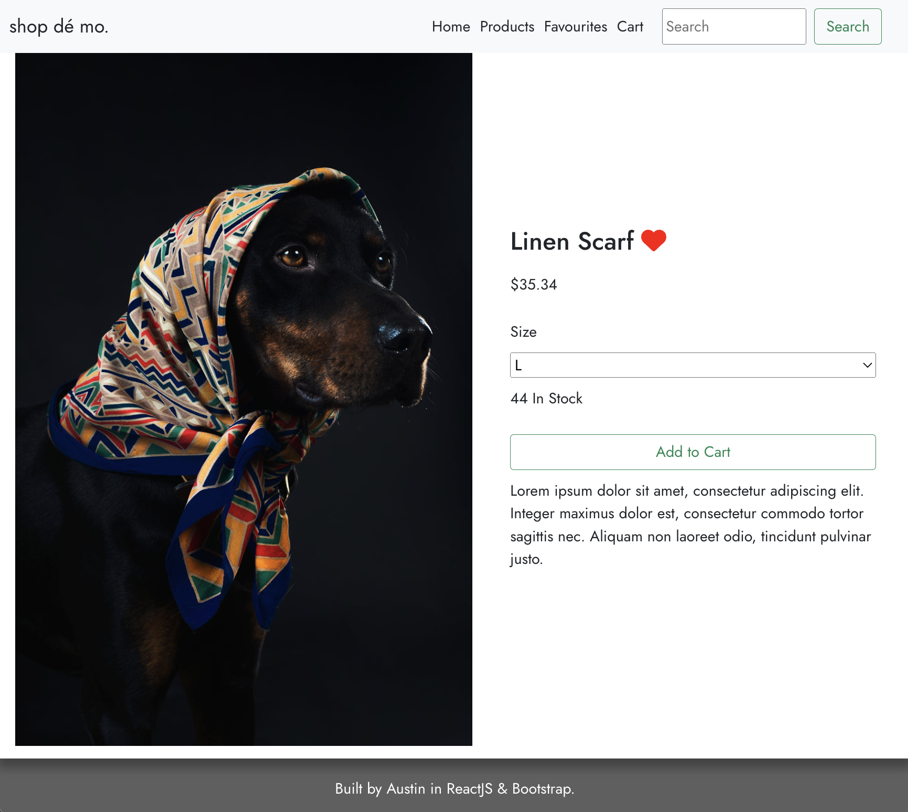
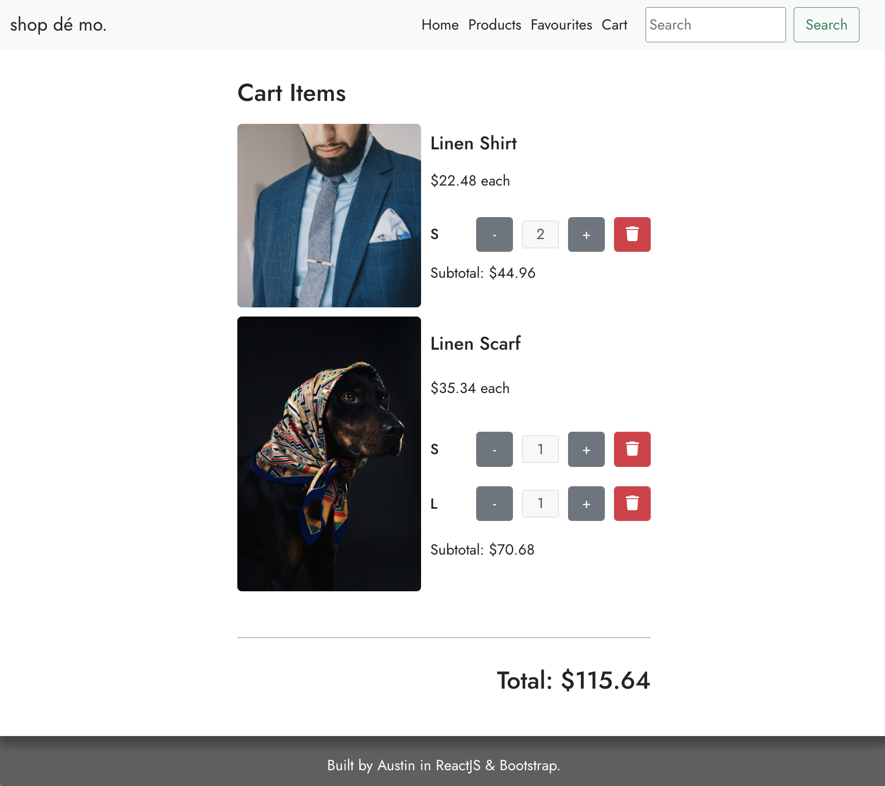

# Shop dé Mo - A React Shop Demo

## Description

A demo e-commerce site using Google Firestore, the React library, and React-Bootstrap.

### 🚀 [Launch Live Project](https://austnly.github.io/react-shop/)

## Table of Contents

-   [Screenshots](#screenshots)
-   [Goals](#goals)
-   [Tech Stack](#tech-stack)
-   [Implementation](#implementation)
    -   [MVP](#mvp)
    -   [Bonus Features](#bonus-features)
    -   [Plan](#planning-logic)
    -   [Issues Addressed](#issues-addressed)
    -   [Bugs](#bugs-to-address)
    -   [Features Added](#additions)
-   [Future Additions](#future-additions)

## Screenshots

<figure>
<figcaption><i>Home Page</i></figcaption>

</figure>

<figure>
<figcaption><i>Product Page</i></figcaption>

</figure>

<figure>
<figcaption><i>Cart</i></figcaption>

</figure>

## Goals

-   To employ a backend cloud database system based on a RESTful API (**Google Firestore**)
-   To facilitate all CRUD actions between the UI and the backend database
-   To practice and improve in deploying **React** and compatible libraries such as **React Router** and **React-Bootstrap** to create a functional and aesthetic UI

## Tech Stack

-   HTML
-   CSS/SCSS
-   JavaScript
-   Git
-   ReactJS
-   React Router DOM
-   (React-Bootstrap)[https://react-bootstrap.github.io]
-   Google Firestore NoSQL Database

## Implementation

### MVP:

Structure

-   2 pages:
    -   Home Page
        -   Grid of products
        -   Carousel of featured products
    -   Product Page (with id parameter) Similar to a product page on another site, allows you to add to cart and select product variants

All products should be stored in Firestore, you should store the following information:

-   quantity
-   variants (could be colors, sizes, etc)
-   price per unit
-   name
-   image url
-   favourited or not (boolean)

All data should be stored in Firestore and fetched by the frontend, there should be NO static product data in the react application

### Bonus Features

-   [x] Using Firestore and react, create a cart system.
-   [x] Create a cart page in your react app
-   [x] Add logic to prevent users from adding items to cart that are no longer in stock.
-   [x] You will have to check the current cart and the product quantity
-   [x] Cart page should have the following:
    -   List of products in cart
    -   ability to change quantity of products in cart
    -   ability to remove items from cart
    -   Make sure you site is scope to one category of products

### Planning Logic

In this project, the biggest challenge was devising the logic for the cart system, which would be housed in a collection separate to the products on the backend, but would need to trigger changes in both collections whenever a product would (attempt to) be added or removed from the cart.

Option 1: Cart Logic using States

1. Click add to cart
1. Check cart state for existing ID
1. If ID exists, add 1 to variant quantity
1. If ID does not exist, create and add 1 to variant quantity
1. Set Cart item for this ID in DB (additional logic)

Option 2: Cart Logic using DB

1. Click add to cart
1. Point to DocId, set all same props except vars
1. If DocId exists, add 1 to var quantity
1. If DocId does not exist, vars should be reset to 0 except passed var, +1
1. Fetch updated cart from DB

Ultimately, I chose option 2 as I found option 1 would result in requiring similar logic to Option 2 when interacting with the database anyway, or otherwise complete rewriting of the cart collection every update, which would be wasteful in terms of network resources.

### Issues Addressed

I encountered the following issues with using React/Firestore and found the following solutions:

-   [x] Using relative paths for images in multiple different components => Made image path info relative to public root folder; Another solution was to import images before use in components
-   [x] Not finding suitable stock data/API data sources => created my own randomised data set to seed to Firestore
-   [x] Fix carousel links
-   [x] Disable add to card on out of stock

### Bugs to Address

-   [ ] Fix cart layout on mobile

### Additions

I added the suggested bonus features, as well as some more functionality to the search:

-   [x] Responsive UI
-   [x] Added pagination
-   [x] Added favourite toggle
-   [x] Added Favourites page

### Future Additions

-   [ ] Add modal to indicate successful add to cart
-   [ ] Add clear cart button to remove all items from cart
